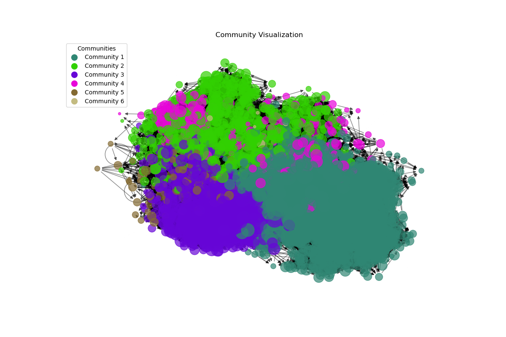

# Community Detection in High-energy Physics Citation Network

## Overview
This project conducts a structural analysis of high-energy physics citation networks from the SNAP database through community detection techniques. The primary aim is to explore if communities within these networks naturally segregate according to specific sub-fields of study.

## Dataset
Utilizing a dataset comprising 34,546 papers with 421,578 citations from the arXiv labeled with hep-ph (High-energy Phenomenology), and contains all the papers in the period from January 1993 to April 2003 (124 months). This dataset has been obtained from SNAP database: https://snap.stanford.edu/data/cit-HepPh.html

## Hypothesis
The hypothesis posits that communities within the citation graph are distinctly formed around different sub-fields. This was explored by:
- Generating metadata by labeling papers (with sub-field tags) based on their content.
- Applying the Infomap algorithm to detect communities.
- Using Fisher's Exact Test to analyze the significance and separation of these communities.
- Visualizing the detected communities

## Methodology
1. **Metadata Generation**: Each paper was labeled with up to three sub-fields based on its title and abstract using a keyword search.
2. **Community Detection**: The Infomap algorithm was employed to detect communities. This method is effective for networks with clear flow dynamics, as it segments the network by minimizing the description length of a random walker's trajectory through the network.
3. **Statistical Analysis**: Fisher’s Exact Test was performed to verify the distinctiveness of communities with respect to the sub-fields, providing insights into the non-random association between community structures and sub-field categorizations. 


## Results
The infomap algorithm has detected 66 communities, with 6 major communities meaning they had more than 500 papers. The remaining minor communities each had less than 10 papers. The reported odds-ratio values and P-value for each subfield in the major 6 communities, confirms our main hypothesis. The P-values are meaningfully low (mostly zero with four digits of precision), and odds ratios are mostly either very low, or meaningfully larger than one. These reported values reject the null-hypothesis, meaning that the observed effect or relationship (seperation of communities with respect to sub-fields) is statistically significant.



The reported statistical values can be seen in Results/community_analysis.txt.

## Structure of the Project

This project is organized into several directories, each serving a specific function in the research and operation of the project. Here's a breakdown of the directory structure and contents:

### Scripts
This folder contains all the operational scripts necessary for the project execution and data analysis.

- `main.py`: The main script that orchestrates the flow of data through the analysis pipeline, from data preprocessing to generating final outputs.
- `community_detection.py`: Contains functions to detect communities within networks using Infomap algorithm.
- `community_analysis.py`: Includes functions for analyzing the detected communities, performing statistical tests, and summarizing the results.
- `label_assigner.py`: Handles the labeling of data points within the network based on predefined criteria.
- `data_access.py`: Manages data retrieval, caching, and storage operations to optimize the workflow.
- `utils.py`: Provides utility functions that support various operations across other scripts.

### Tests
Includes unit tests for the scripts to ensure each component functions correctly before deployment.

- `test_community_detection.py`: Tests the community detection functionalities.
- `test_community_analysis.py`: Verifies the analysis and statistical summarization of communities.
- `test_label_assigner.py`: Ensures that labeling is accurate and efficient.
- `test_data_access.py`: Checks data handling operations for robustness and reliability.
- `test_utils.py`: Confirms that utility functions perform as expected.

### Results
Contains all outputs from the scripts, such as reported community statistics and the visualizations.

- `data/`: Holds any processed data sets or intermediate files generated during analysis.

### Documentation

- `README.md`
- `requirements.txt`: Lists all dependencies required by the project, ensuring reproducibility.

This structure is designed to keep the project organized, maintainable, and scalable, facilitating future enhancements and collaborative development.


## Installation
Steps on how to get the development environment running:
```bash
git clone https://github.com/memerioo/CommunityDetection.git
cd CommunityDetection
pip install -r requirements.txt
```
After instaling the requirements, the program can be run by:
```bash
python scripts/main.py
```
